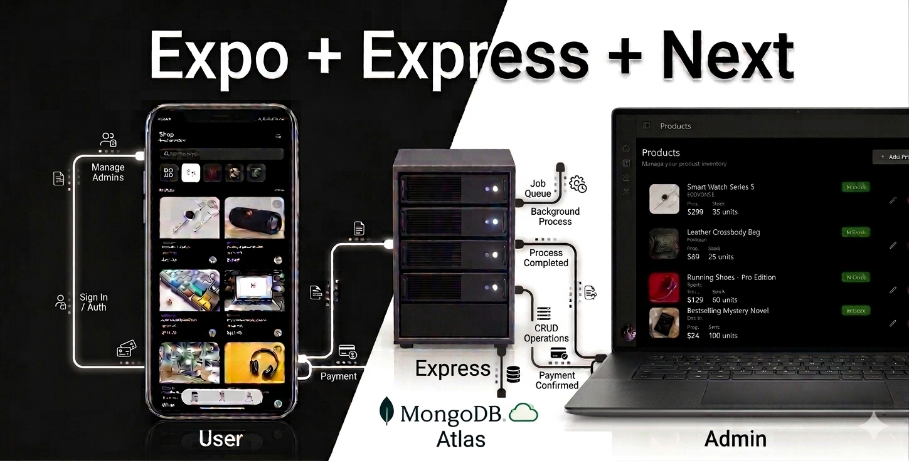

# Expo E-Commerce Platform



A full-stack e-commerce solution built with Expo (React Native), Next.js, and Express.js. This repository is structured as a monorepo containing three main applications: a mobile client, an admin dashboard, and a backend API.

<p align="center">
  
  
  
  
  
  
  <br />
  
  
  
  
  
  
</p>

## Project Structure

- `/mobile` - The consumer-facing mobile application built with Expo and React Native.
- `/admin` - The web-based admin dashboard to manage the platform built with Next.js.
- `/backend` - The RESTful backend API built with Express.js and MongoDB.

---

## Tech Stack & Libraries

### Mobile App (`/mobile`)

- **Framework**:  Expo (~54.0.33) /  React Native
- **Navigation**: Expo Router & React Navigation
- **Styling**:  NativeWind & Tailwind CSS
- **Authentication**:  Clerk Expo
- **Data Fetching**: React Query & Axios
- **Payments**: Stripe React Native
- **Monitoring**: Sentry React Native
- **Language**:  TypeScript

### Admin Dashboard (`/admin`)

- **Framework**:  Next.js (v16.1.6)
- **Styling**:  Tailwind CSS (v4) & DaisyUI
- **Authentication**:  Clerk Next.js
- **Icons**: Lucide React
- **Data Fetching**: Axios
- **Language**:  TypeScript

### Backend API (`/backend`)

- **Runtime**:  Node.js
- **Framework**:  Express.js (v5.2.1)
- **Database**:  MongoDB via Mongoose
- **Authentication**:  Clerk Express
- **Background Jobs**:  Inngest
- **Media Storage**:  Cloudinary & Multer
- **Security & Logging**: Helmet, CORS, Morgan, Winston
- **Language**:  TypeScript

### Root Utilities

- **Linting & Formatting**: ESLint, Prettier
- **Git Hooks**: Husky, Lint-staged

---

## Environment Variables

You need to set up `.env` files for each workspace. Refer to the respective READMEs in `/mobile`, `/admin`, and `/backend` for specific variable details.

---

## Getting Started

### Prerequisites

Make sure you have the following installed on your machine:

- Node.js (v18 or higher recommended)
- **pnpm** (Package manager)
- MongoDB instance (local or MongoDB Atlas)
- Expo Go app on your mobile device (if testing physically)

### 1. Clone the repository

```bash
git clone <repository-url>
cd Expo-ecommerce
```

### 2. Install Dependencies

We use `pnpm` exclusively in this project. Run the installation in the root and each respective folder:

```bash
pnpm install
cd backend && pnpm install
cd ../admin && pnpm install
cd ../mobile && pnpm install
```

### 3. Start the Applications

**Backend API:**

```bash
cd backend
pnpm dev
```

**Admin Web Dashboard:**

```bash
cd admin
pnpm dev
```

**Mobile App:**

```bash
cd mobile
pnpm start
```

---

## Scripts

- `pnpm run lint`: Lints the entire project.
- `pnpm run lint:{mobile|web|server}`: Lints a specific application.
- `pnpm run format`: Automatically formats code in the project using Prettier.

## Contributing

Contributions, issues, and feature requests are welcome!

## License

This project is licensed under the [MIT License](LICENSE).
